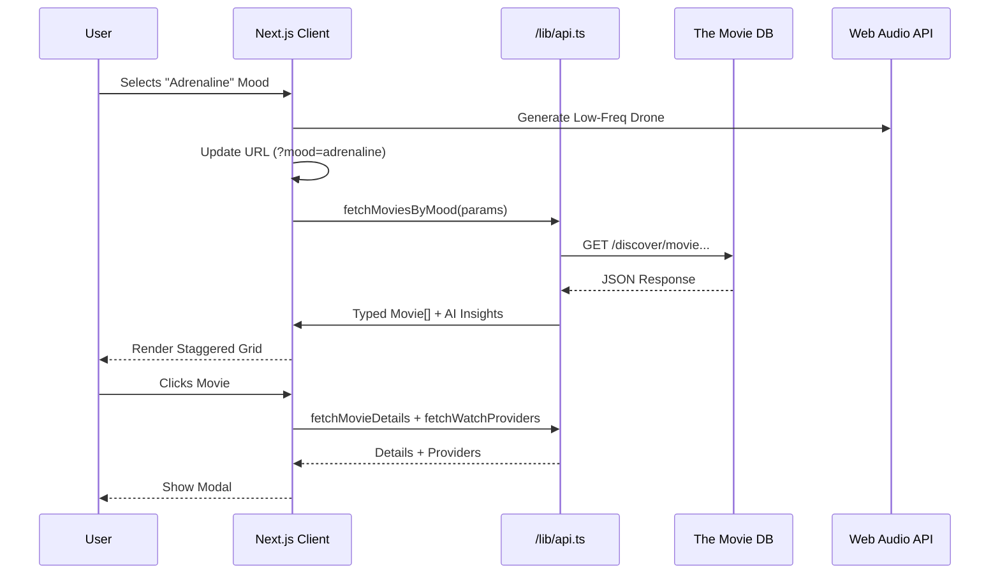

# ✦ Lumina 2.0
> **Stop searching. Start feeling.**


[](https://github.com/Dynamo14324/lumina-moodboard/actions)
[](https://nextjs.org/)
[](https://vercel.com/)

**Lumina** is an autonomous cinematic discovery engine that replaces keyword searching with emotional intuition. By mapping complex sentiment descriptors ("Ethereal", "Melancholy", "Adrenaline") to weighted TMDB query parameters, it surfaces films that match your *internal state* rather than your watch history.

## 🚀 Live Demo
[Deploy to Vercel](https://vercel.com/new/clone?repository-url=https%3A%2F%2Fgithub.com%2FDynamo14324%2Flumina-moodboard)

---

## ⚡ Key Features (v2.0)

### 🎭 Mood-Based Discovery
Emotional filtering over genre filtering. Select a mood to generate a curated cinematic soundscape.

### 🎵 Sonic Ambience
Immersive, procedural audio drones generated via the Web Audio API that adapt to your selected mood (e.g., deep bass for Adrenaline, shimmering pads for Ethereal).

### 🧠 AI Curator
Contextual "AI Insight" badges that explain *why* a movie fits the specific mood, offering a layer of interpretative metadata.

### 📽️ Deep Dive Modal
A premium glassmorphism modal featuring:
- **Official Trailers**: Instant playback (auto-stops on close).
- **Where to Watch**: Region-aware streaming providers via JustWatch/TMDB.
- **Top Cast**: Visual cast grid.
- **Shareable Deep Links**: Copy the URL to share your exact discovery.

### ❤️ My Stash (Watchlist)
Persist your discoveries with a local-first watchlist drawer, allowing you to curate a session-independent collection.

---

## 🏗 Architecture



## 🛠 Tech Stack

| Tech | Purpose |
|------|---------|
| **Data** | The Movie Database (TMDB) |
| **Framework** | Next.js 14 (App Router) |
| **Styling** | Tailwind CSS + clsx |
| **Animation** | Framer Motion |
| **Audio** | Native Web Audio API (No libraries) |
| **SEO** | OpenGraph + JSON-LD (Implemented) |

## 🌍 Localization & SEO
- **Region Awareness**: Automatically detects/defaults to US region for streaming providers, adjustable via API params.
- **Micro-Metadata**: Optimized meta tags for Twitter Cards and OpenGraph sharing.
- **Deep Linking**: Full state synchronization between URL and UI (`?mood=x&movie=y`).

## 🔮 Why I Built This

Standard recommendation algorithms create echo chambers. If you watch one sci-fi movie, you get 10 more. **Lumina** breaks this cycle by asking "How do you want to *feel*?" allowing for cross-genre discovery that respects emotional context over categorical metadata.

## 💰 Monetization & Partnerships (v1.0)

Lumina features a built-in, non-intrusive monetization architecture designed to support the platform without degrading UX.

### Features
- **Google AdSense Native Ads**: Blends seamlessly into the movie grid and footer.
- **Amazon Affiliate**: Contextual "Buy Physical Media" links in movie details.
- **Support System**: "Support the Architecture" CTA.

### Setup Guide
To activate ads, add the following to your environment variables (e.g., in Vercel):

```bash
NEXT_PUBLIC_ADSENSE_ID=ca-pub-XXXXXXXXXXXXXXXX  # Your Publisher ID
NEXT_PUBLIC_AD_SLOT_FOOTER=XXXXXXXXXXXXXXXX     # Footer Ad Unit ID
NEXT_PUBLIC_AD_SLOT_CARD=XXXXXXXXXXXXXXXX       # Grid/Feed Ad Unit ID
```

Configuration can also be managed in `src/lib/monetization.ts`.

---

*Architected by **Dynamo_14324**.*
