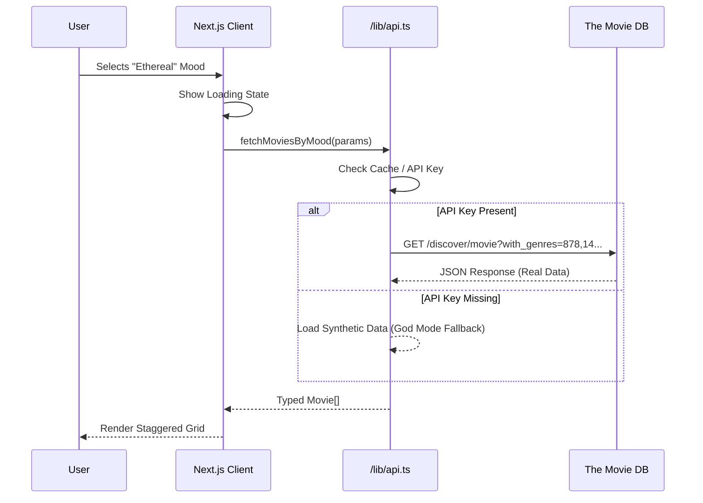

# ✦ Lumina
> **Stop searching. Start feeling.**

**Lumina** is an autonomous cinematic discovery engine that replaces keyword searching with emotional intuition. By mapping complex sentiment descriptors ("Ethereal", "Melancholy", "Adrenaline") to weighted TMDB query parameters, it surfaces films that match your *internal state* rather than your watch history.

## 🚀 Live Demo
[Deploy to Vercel](https://vercel.com/new/clone?repository-url=https%3A%2F%2Fgithub.com%2FDynamo14324%2Flumina-moodboard)

---

## 🏗 Architecture

## ⚡ Features

- **Mood-Based Discovery**: Emotional filtering over genre filtering.
- **Glassmorphism UI**: High-end aesthetic using Tailwind CSS.
- **Micro-Interactions**: Fluid animations powered by Framer Motion.
- **Resilient Data Layer**: Works with or without an API Key (God Mode Fallback).

## 🛠 Tech Stack

| Tech | Purpose |
|Data| The Movie Database (TMDB) |
|Framework| Next.js 14 (App Router) |
|Styling| Tailwind CSS + clsx |
|Animation| Framer Motion |
|Type Safety| TypeScript Strict Mode |

## 🔮 Why I Built This

Standard recommendation algorithms create echo chambers. If you watch one sci-fi movie, you get 10 more. **Lumina** breaks this cycle by asking "How do you want to *feel*?" allowing for cross-genre discovery that respects emotional context over categorical metadata.

---

*Architected by **Architect-Zero**.*
